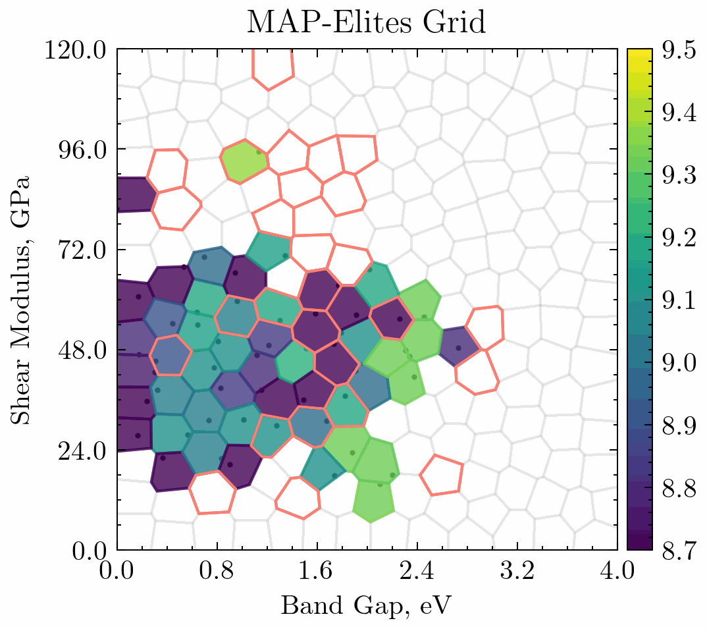

# QD4CSP: Quality Diversity for Crystal Structure Prediction
<p align="center">

</p>


`QD4CSP` is the first of its kind implementation combining the strengths of Quality-Diversity algorithms
for inorganic crystal structure prediction. 
This repository contains the code used for the paper _Illuminating the property space in crystal structure prediction using 
Quality-Diversity algorithms_.

The gif shows the evolution of an archive of $TiO_2$ crystal structures over 5000 evaluations.

## Getting Started with the Package
To get started either follow the installation with poetry or proceed and use the provided docker image.

### Installation
_If you're intending to use docker you can skip this section._

To get started with this package clone this repo:
```bash
git clone https://github.com/adaptive-intelligent-robotics/QD4CSP
```
Then enter the correct directory on your machine:
```bash
cd QD4CSP
```

This package uses [poetry](https://python-poetry.org) dependency manager. 
To install all dependencies run:
```bash
poetry install
```

#### [Optional] Setting up Environment Variables
This repo relies on 4 environment variables:
* `EXPERIMENT_FOLDER`
* `MP_REFERENCE_FOLDER`
* `CONFIGS_FOLDER`
* `MP_API_KEY`

The former 3 are set up with defaults which save the experiments in the following structure:
```shell
├── experiment_configs #CONFIGS_FOLDER
│  ├── C_like_benchmark.json
│  ├── demo.json
│  ├── SiC_like_benchmark.json
│  ├── SiO2_like_benchmark.json
│  ├── TiO2_benchmark.json
├── experiments # EXPERIMENT_FOLDER
│  ├── centroids
│  │  ├── centroids_200_2_C_band_gap_0_1_shear_modulus_0_1.dat
│  │  ├── centroids_200_2_SiO2_band_gap_0_1_shear_modulus_0_1.dat
│  │  ├── centroids_200_2_Sic_band_gap_0_1_shear_modulus_0_1.dat
│  │  ├── centroids_200_2_band_gap_0_1_shear_modulus_0_1.dat
├── mp_reference_analysis # MP_REFERENCE_FOLDER
│  ├── C_24
│  ├── SiO2_24
│  └── TiC_24
│  └── TiO2_24
```
If desired please set the necessary environment variables using 
```shell
export <env-variable-name>=<directory-location>
```
or your preferred method. 

NB: the `centroids` folder must be one layer inside the `EXPERIMENT_FOLDER`.

### External Integrations Set Up
#### [Required] Materials Project
For comparison to reference structures we use the Materials Project API.
Prior to running the code you must [set up your own account](https://next-gen.materialsproject.org) on the Materials Project and 
get the api key from your dashboard following the instructions [here](https://next-gen.materialsproject.org/api).

Then add your API key as an environment variable like so:
```shell script
export MP_API_KEY=<your-api-key>
```

## Using the Package
Follow the section with your preferred method (docker or poetry).

### Poetry
#### Running a Demo
To run a demo experiment using our cli run:
```shell
poetry run map-elites
```

This will run a very simple demo with 2 initialised $TiO_2$ structures and 6 evaluation steps without any relaxation. 
All results will be saved under the `experiments` folder.


#### Running an Experiment 
_If you are NOT using the $C$, $SiO_2$, $SiC$ or $TiO_2$ system refer to section New materials set up below._

Experiments are most conveniently defined using a configuration file.
```shell
poetry run map-elites experiment_configs/<desired-config-name>
```

To run the experiments with the reported configurations use any of the provided files:
`TiO2_benchamrk.json`, `SiO2_like_benchmark.json`, `SiC_like_benchmark.json` and `C_like_benchmark.json`

If desired, you can generate a prefilled configuration file using our cli that should be updated with your requirements:
```shell
poetry run generate-config -c <desired-config-name>
```

#### New Material set up 
Then run:
```shell
poetry run add-new-reference -formula <material_formula> --element_list <list_of_elements> --atom_counts <count_of_each_element>
```
For example a command to compute data for $TiO_2$ with 6 atoms we would call:
```shell
poetry run add-new-reference -formula TiO2 --element_list Ti O --atom_counts 2 4
```

The `band_gap_limits`, `shear_modulus_limits` and `fitness_limits` arguments are optional. 
If not set, limits will be computed, but we recommend using them as guidance and setting your own limits when running experiments.

#### Reproducing Results
To reproduce the results reported in our paper first download the data:
```shell
poetry run download-data
```
Then run:
```shell
poetry run reproduce-results
```
This will generate all reported figures inside `experiments/reported_results/reported_figures`
alongside a `readme.txt` which provides additional information.

### Docker
Pull the latest image from docker hub:
```shell
docker pull mwolinska/qd4csp:latest
docker tag mwolinska/qd4csp qd4csp 
```

Or you can build it locally from scratch:
```shell
docker build  . -t qd4csp 
```

#### Run an Experiment
To launch a demo run:
```shell
docker compose run map-elites
```
To run an experiment pass a config file into the command:
```shell
EXP=experiment_configs/<desired-config-file> docker compose run map-elites
```

#### Reproduce Results
To reproduce the results reported in the paper simply run:
```shell
docker compose run reproduce-results
```

#### Running Interactively 
You can also use the docker image interactively to run any of the commands described in the _poetry_ section above. 
To do so first start the container:
```shell
docker compose run qd4csp 
```
Then use the container as you would a poetry environment. 
